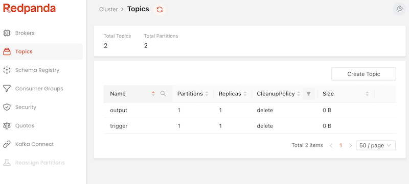
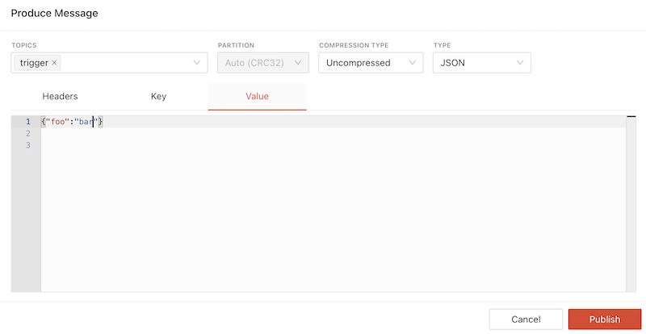
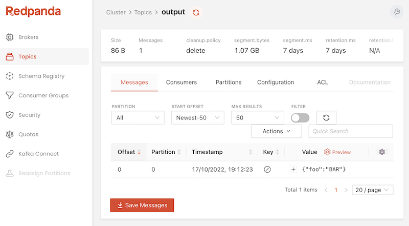

# Azure Function with Kafka Trigger & Output Binding

Spring Cloud Function example for implementing an Azure functions with [KafkaTrigger](https://learn.microsoft.com/en-us/azure/azure-functions/functions-bindings-kafka-trigger?tabs=in-process%2Cconfluent&pivots=programming-language-java) and [Kafka Binding](https://learn.microsoft.com/en-us/azure/azure-functions/functions-bindings-kafka-output?tabs=in-process%2Cconfluent&pivots=programming-language-java) support.

The Azure function is triggered by messages sent on the `trigger` topic and in turn calls the `uppercase` SCF with the trigger payload. The SCF capitalizes the input json value fields and sends the result to an output Kafka topic called: `output`.

## Running Locally

First start a Kafka server locally. 
The `./src/main/resources/docker-compose-demo.yaml` helps to start locally Zookeeper, Kafka and Kafka UI.

```
docker-compose -f ./src/main/resources/docker-compose-demo.yaml up
```
You can reach the Kafka UI (Redpanda) dashboard on http://localhost:8080/topics



The docker-compose pre-creates the `trigger` and `output` topics used by the function.

Next build and run the Azure function:

```
./mvnw clean package
./mvnw azure-functions:run
```

From the Kafka UI, got to the `trigger` topic view (http://localhost:8080/topics/trigger), select `Actions/Publish Message` and submit a new JSON message:
```json
{ "foo" : "bar"}
```




Push the `Publish` button and let the function do its job and check the `output` topic (http://localhost:8080/topics/output) :



e.g.the `bar` is in uppercase:

```json
{ "foo" : "BAR"}
```


## Running on Azure (TODO: WIP)

Make sure you are logged in your Azure account.
```
az login
```

Build and deploy

```
./mvnw clean package
./mvnw azure-functions:deploy
```

## Implementation

Configure the [Kafka extension](https://learn.microsoft.com/en-us/azure/azure-functions/functions-bindings-kafka?tabs=in-process%2Cportal&pivots=programming-language-java#hostjson-settings) in the `host.json` settings:

```json
{
    "functionTimeout": "00:05:00",
    "version": "2.0",
    "extensions": {
        "kafka": {
            "maxBatchSize": 64,
            "SubscriberIntervalInSeconds": 1,
            "ExecutorChannelCapacity": 1,
            "ChannelFullRetryIntervalInMs": 50
        }
    },
    "extensionBundle": {
        "id": "Microsoft.Azure.Functions.ExtensionBundle",
        "version": "[3.3.0, 4.0.0)"
    }
}
```

Also to allow your functions to scale properly on the Premium plan when using Kafka triggers and bindings, you need to [enable runtime scale monitoring](https://learn.microsoft.com/en-us/azure/azure-functions/functions-bindings-kafka?tabs=in-process%2Cportal&pivots=programming-language-java#enable-runtime-scaling).


## Notes

* Disable the `spring-boot-maven-plugin` in favor of the `azure-functions-maven-plugin`.
* Exclude the `org.springframework.boot:spring-boot-starter-logging` dependency from the `org.springframework.cloud:spring-cloud-function-adapter-azure`.
* In `local.settings.json` set the local values for the `%BrokerList`, `%ConfluentCloudUsername%` and the `%TriggerKafkaTopic%` trigger and binding variables:

```
{
	"IsEncrypted": false,
	"Values": {
...
		"BrokerList": "localhost:9092",
		"ConfluentCloudUsername": "test",
		"TriggerKafkaTopic": "trigger"
	}
}
```
